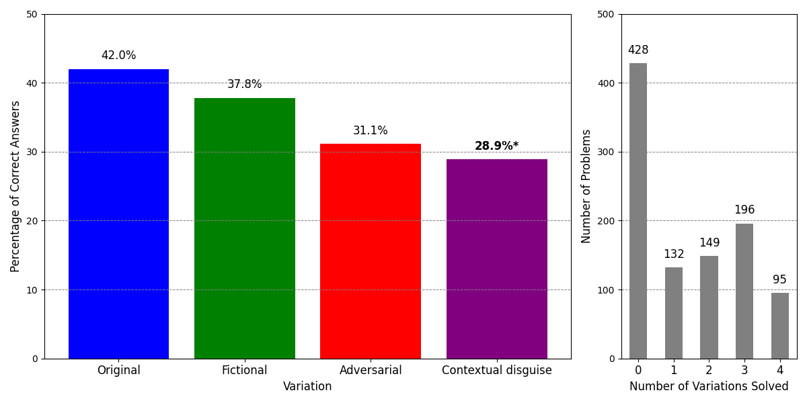

# Methods of Synthetic Data Generation for Combinatorial Problems with Large Language Models

This repository contains the code and data used for a research experiment evaluating the capabilities of large language models (LLMs) in processing and generating mathematical texts. The research introduces new problem variations and a metric that captures the performance rate and correlation between baseline problems and generated variations.

The dataset is available in `JSON` and in `Parquet` formats on the [Hugging Face](https://huggingface.co/datasets/andynik/comb-gen-24) repository in two sizes:
- 1,000 problems (4,000 problems with variations)
- 5,583 problems (22,332 problems with variations)

## Project Stages

- **Stage 1: Data Filtering**
  - Filter subset of compbinatorial problems from the [NuminaMath-COT](https://huggingface.co/datasets/AI-MO/NuminaMath-COT).
  - Utilise LLM and regex formulas for answer extraction.

- **Stage 2: Variation Generation**
  - Use LLM to generate three new variations of the original problems: *fictional*, *adversarial* and *contextual disguise*.
  - Generate solutions for each variation, including *original*
  - Utilise LLM and regex formulas for answer extraction.

- **Stage 3: Analysis**
  - Run permutation tests and correlation tests.
  - Prepare plots about solution rates and correlation heatmap across variations.
  - Apply _F1 Variations Consistency Score_ to assess the quality of the generated data.
 
## Results



_Star ‘*’ represents that the difference was significant._
 
## Experiment specifications

### Models Used in the Experiment

The open-source models tested during experimentation have been quantized using K-means quantization with the help of the [llama.cpp](https://github.com/ggerganov/llama.cpp) library.

| Model                  | Quant. | Quant. Method | Access      | Model Creator |
|------------------------|--------|---------------|-------------|---------------|
| LLaMA-2-7B-Chat        | ✓      | Q4_K_M        | Open-source | Meta          |
| LLaMA-3-8B-Instruct    | ✓      | Q4_K_M        | Open-source | Meta          |
| Mathstral-7B           | ✓      | Q4_K_M        | Open-source | Mistral AI    |
| Mixtral-8x7B-Instruct  | ✓      | Q4_K_M        | Open-source | Mistral AI    |
| Qwen2-7B-Instruct      | ✓      | Q4_K_M        | Open-source | Qwen          |
| Qwen2-Math-7B          | ✓      | Q4_K_M        | Open-source | Qwen          |
| GPT-4o-mini-2024-07-18 | ✗      | N/A           | API         | OpenAI        |

### GPU

NVIDIA Quadro RTX 8000 with 48 GB of RAM.

### OS
```
OS Ubuntu 22.04.5 LTS
OS kernel 6.2.0-37-generic
```

### Installation

To set up the environment and run the scripts, install the necessary Python (v3.10.12) libraries using the provided `requirements.txt` file:

```bash
pip install -r requirements.txt
```

## Dataset Information

### NuminaMath-CoT Data (the baseline)

| Column Name | Description                          |
|-------------|--------------------------------------|
| problem_id  | Unique identifier for each problem.  |
| source      | Problem origin.                      |
| problem     | Problem statement.                   |
| solution    | Problem solution.                    |
| messages    | Chain-of-Thought data.               |
| answer      | Problem answer extracted (expected). |

### Generated Data

| Column Name     | Description                                    |
|-----------------|------------------------------------------------|
| fictional       | Fictional variation of the problem.            |
| adversarial     | Adversarial variation of the problem.          |
| contdis         | Contextual disguise variation of the problem.  |
| original_sol    | Original variation solution generated by model.|
| fictional_sol   | Fictional variation solution.                  |
| adversarial_sol | Adversarial variation solution.                |
| contdis_sol     | Contextual disguise variation solution.        |
| original_ans    | Original variation answer extracted.           |
| fictional_ans   | Fictional variation answer extracted.          |
| adversarial_ans | Adversarial variation answer extracted.        |
| contdis_ans     | Contextual disguise answer extracted.          |

More details on the [Hugging Face](https://huggingface.co/datasets/andynik/comb-gen-24) repository.

## Usage

You are encouraged to use this dataset to further evaluate problem-solving strategies in LLMs or other domains. Please cite our paper if you publish material based on this dataset.

### License

This dataset is licensed under the MIT License. See the `LICENSE` file for more details.

### Citation

```bibtex
@misc{nikolaiev2025synth,
    author = {Nikolaiev, Andrii D. and Anisimov, Anatolii V.},
    title = {Neural Network Methods for Selecting and Generating Synthetic Variations of Combinatorial Problems},
    journal = {Cybernetics and Systems Analysis},
    year = {2025},
    note = {Accepted, to be published in May 2025}
}
```
